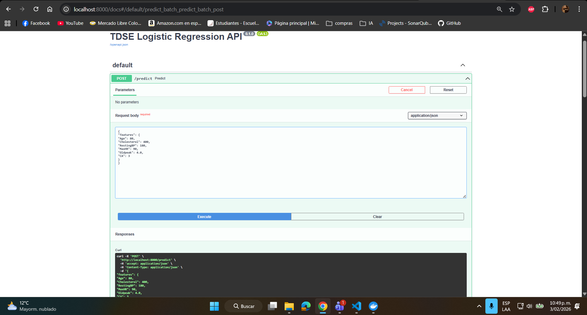
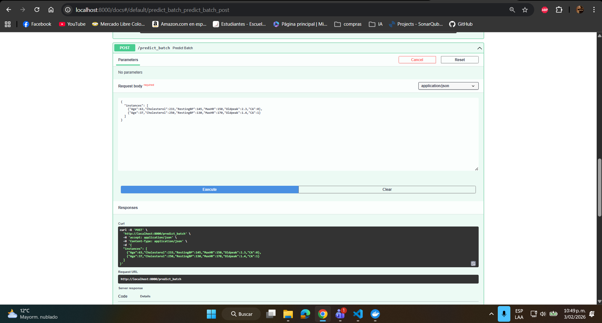
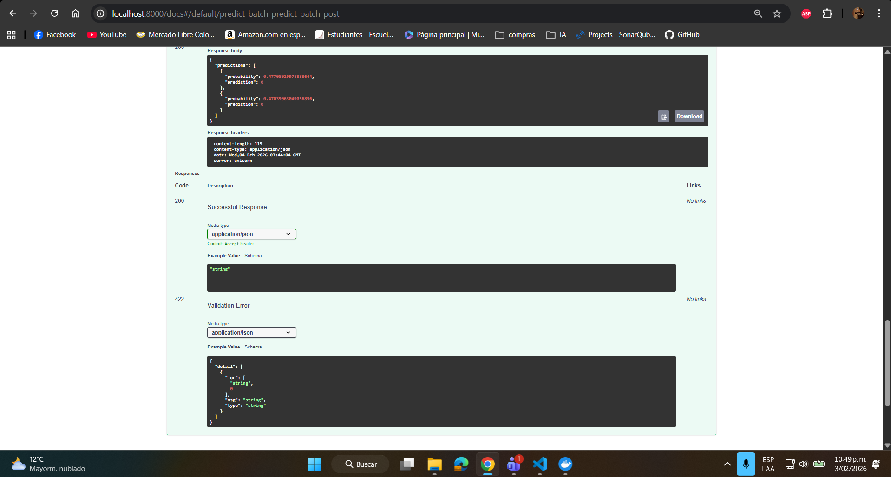

## Heart Disease Risk Prediction using Logistic Regression
Tomas Felipe Ramirez Alvarez
## Heart Disease Risk Prediction — Regresión Logística
Autor: Tomas Felipe Ramirez Alvarez

### Resumen
Este proyecto implementa una regresión logística desde cero (NumPy) para predecir la presencia de enfermedad cardíaca. El análisis incluye carga y EDA del dataset, selección y normalización de features, implementación de funciones teóricas (sigmoid, coste, gradiente, GD), entrenamiento, evaluación, visualización de fronteras de decisión, barrido de regularización L2 y una guía para desplegar el modelo en Amazon SageMaker.

### Dataset
- Fuente: Kaggle — neurocipher/heartdisease (https://www.kaggle.com/datasets/neurocipher/heartdisease)
- Archivo en este repositorio: Heart_Disease_Prediction.csv
- Muestras: 303
- Target: `Heart Disease` (valores: `Presence`, `Absence`) — el notebook lo convierte a 1/0.

### Estructura y entregables
- `cuaderno1.ipynb`: Notebook con todo el flujo de trabajo (EDA, entrenamiento, visualizaciones, regularización y guardado de modelo).
- `Heart_Disease_Prediction.csv`: Dataset (debe estar presente localmente).
- `best_model.npz`: Archivo generado tras ejecutar el barrido de lambdas (contiene `w`, `b`, `mu`, `sigma`, `features`).

### Requisitos
- Python 3.8+
- Paquetes: pandas, numpy, matplotlib

## Heart Disease Risk Prediction — Logistic Regression
Author: Tomas Felipe Ramirez Alvarez

### Summary
This project implements logistic regression from scratch (NumPy) to predict the presence of heart disease. The notebook includes dataset loading and EDA, feature selection and normalization, implementation of theoretical functions (sigmoid, cost, gradient, GD), training and evaluation, decision-boundary visualization, an L2 regularization sweep, and a brief guide for deploying the model on Amazon SageMaker.

### Dataset
- Source: Kaggle — neurocipher/heartdisease (https://www.kaggle.com/datasets/neurocipher/heartdisease)
- File included: `Heart_Disease_Prediction.csv`
- Samples: 303
- Target: `Heart Disease` (values: `Presence`, `Absence`) — the notebook binarizes it to 1/0.

### Structure and deliverables
- `cuaderno1.ipynb`: Notebook with the full workflow (EDA, training, visualizations, regularization sweep, and model saving).
- `Heart_Disease_Prediction.csv`: Dataset (should be present locally).
- `best_model.npz`: File produced after the lambda sweep (contains `w`, `b`, `mu`, `sigma`, `features`).

### Requirements
- Python 3.8+
- Packages: `pandas`, `numpy`, `matplotlib`

Quick install:

```powershell
pip install pandas numpy matplotlib
```


### Despliegue y uso rápido

- Probar (un registro):
```powershell
   {
   "features": {
   "Age": 80,
   "Cholesterol": 400,
   "RestingBP": 180,
   "MaxHR": 90,
   "Oldpeak": 4.0,
   "CA": 3
   }
   }
   -----------------------
      {
   "instances": [
      {"Age":63,"Cholesterol":233,"RestingBP":145,"MaxHR":150,"Oldpeak":2.3,"CA":0},
      {"Age":37,"Cholesterol":250,"RestingBP":130,"MaxHR":170,"Oldpeak":1.4,"CA":1}
   ]
   }
```
- Swagger UI: http://localhost:8000/docs  (probar `POST /predict` y `POST /predict_batch`)


### evidence

-  
-  
-  
- 
-  
-  
- 

### Recent results (examples)

- Single example sent to `/predict`:
   - Input: `{"features": {"Age": 80, "Cholesterol": 400, "RestingBP": 180, "MaxHR": 90, "Oldpeak": 4.0, "CA": 3}}`
   - Result: `{"probability": 0.99..., "prediction": 1}` — the model estimates a high risk (positive prediction) for this extreme case.

- Example sent to `/predict_batch` (two instances with moderate values):
   - Input: two records with Age 63 and 37 (cholesterol, blood pressure, etc.).
   - Result: probabilities ≈ 0.47 and 0.47 → `prediction: 0` (absence under the 0.5 threshold).

**Short interpretation**
- The default decision threshold is 0.5; values above classify as `1` (presence) and below as `0` (absence).
- A probability close to 0.5 indicates uncertainty; clinical decisions should not be based solely on this output.
- Before production: evaluate performance on a held-out test set (accuracy, precision, recall, F1, AUC), check calibration, and log predictions to monitor data drift.

### Conclusions
1. Training logistic regression from scratch provides a clear baseline and interpretable coefficients; performance metrics are computed and shown in the notebook.
2. L2 regularization reduces weight magnitude and can improve generalization; tuning lambda demonstrated a trade-off between bias and variance.
3. Some feature pairs (such as Age vs. Cholesterol) exhibit better class separability; feature engineering or non-linear models could further improve results.
4. Saving model parameters (`best_model.npz`) simplifies deployment workflows (SageMaker or lightweight REST services) for real-time risk scoring.
 


