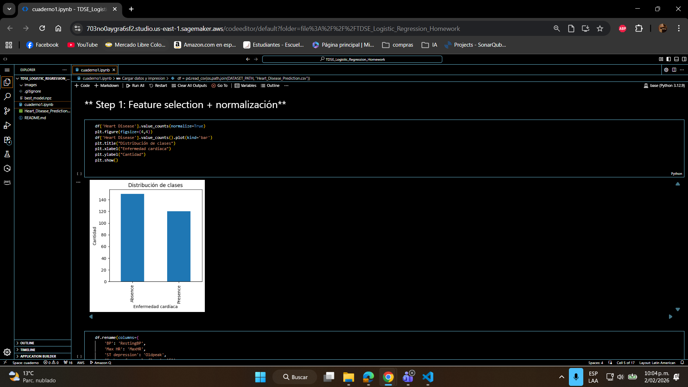
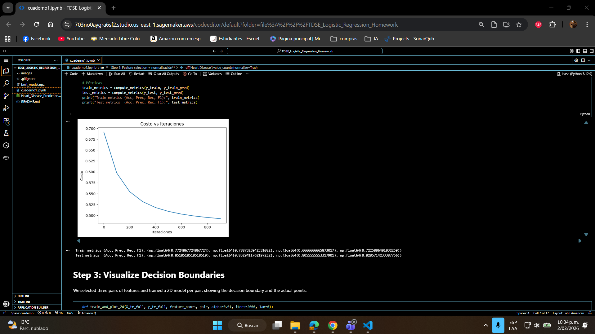
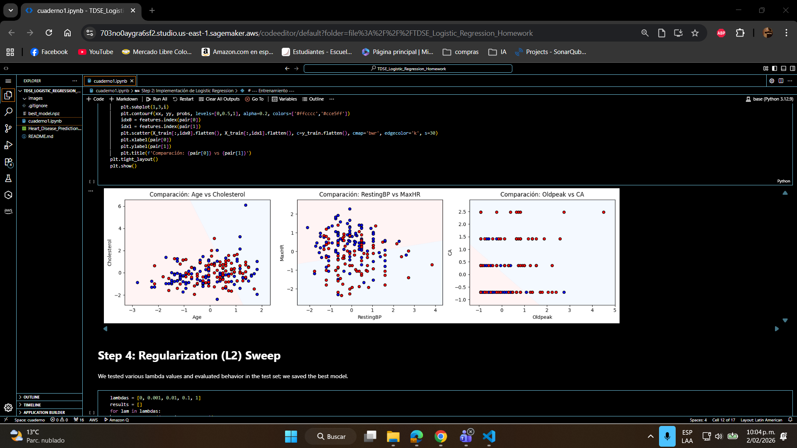
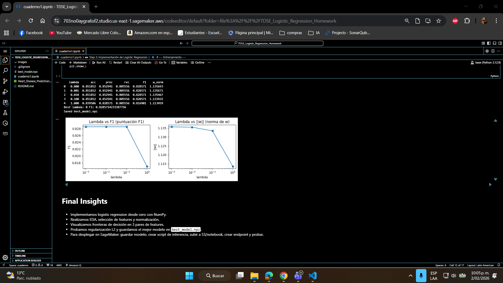

## Heart Disease Risk Prediction using Logistic Regression
Tomas Felipe Ramirez Alvarez
## Heart Disease Risk Prediction — Regresión Logística
Autor: Tomas Felipe Ramirez Alvarez

### Resumen
Este proyecto implementa una regresión logística desde cero (NumPy) para predecir la presencia de enfermedad cardíaca. El análisis incluye carga y EDA del dataset, selección y normalización de features, implementación de funciones teóricas (sigmoid, coste, gradiente, GD), entrenamiento, evaluación, visualización de fronteras de decisión, barrido de regularización L2 y una guía para desplegar el modelo en Amazon SageMaker.

### Dataset
- Fuente: Kaggle — neurocipher/heartdisease (https://www.kaggle.com/datasets/neurocipher/heartdisease)
- Archivo en este repositorio: Heart_Disease_Prediction.csv
- Muestras: 303
- Target: `Heart Disease` (valores: `Presence`, `Absence`) — el notebook lo convierte a 1/0.

### Estructura y entregables
- `cuaderno1.ipynb`: Notebook con todo el flujo de trabajo (EDA, entrenamiento, visualizaciones, regularización y guardado de modelo).
- `Heart_Disease_Prediction.csv`: Dataset (debe estar presente localmente).
- `best_model.npz`: Archivo generado tras ejecutar el barrido de lambdas (contiene `w`, `b`, `mu`, `sigma`, `features`).

### Requisitos
- Python 3.8+
- Paquetes: pandas, numpy, matplotlib

## Heart Disease Risk Prediction — Logistic Regression
Author: Tomas Felipe Ramirez Alvarez

### Summary
This project implements logistic regression from scratch (NumPy) to predict the presence of heart disease. The notebook includes dataset loading and EDA, feature selection and normalization, implementation of theoretical functions (sigmoid, cost, gradient, GD), training and evaluation, decision-boundary visualization, an L2 regularization sweep, and a brief guide for deploying the model on Amazon SageMaker.

### Dataset
- Source: Kaggle — neurocipher/heartdisease (https://www.kaggle.com/datasets/neurocipher/heartdisease)
- File included: `Heart_Disease_Prediction.csv`
- Samples: 303
- Target: `Heart Disease` (values: `Presence`, `Absence`) — the notebook binarizes it to 1/0.

### Structure and deliverables
- `cuaderno1.ipynb`: Notebook with the full workflow (EDA, training, visualizations, regularization sweep, and model saving).
- `Heart_Disease_Prediction.csv`: Dataset (should be present locally).
- `best_model.npz`: File produced after the lambda sweep (contains `w`, `b`, `mu`, `sigma`, `features`).

### Requirements
- Python 3.8+
- Packages: `pandas`, `numpy`, `matplotlib`

Quick install:

```powershell
pip install pandas numpy matplotlib
```

### How to run
1. Place `Heart_Disease_Prediction.csv` in the repository root.
2. Open `cuaderno1.ipynb` in Jupyter or VS Code and run cells top-to-bottom.
3. The notebook will:
   - Perform EDA and basic cleaning (counts, distributions).
   - Select features and apply Z-score normalization.
   - Implement and train logistic regression using gradient descent.
   - Visualize decision boundaries for selected feature pairs.
   - Sweep L2 regularization (lambda) and save the best model to `best_model.npz`.

Optional command to open the notebook:

```powershell
jupyter notebook cuaderno1.ipynb
```

### Reproducible results
- After running, the notebook prints metrics (accuracy, precision, recall, F1) per lambda and generates the plots (plot titles are in Spanish).
- `best_model.npz` contains all parameters needed for inference (weights, bias, and normalization parameters).

### evidence

-  
-  
-  
- 

### Conclusions
1. Training logistic regression from scratch provides a clear baseline and interpretable coefficients; performance metrics are computed and shown in the notebook.
2. L2 regularization reduces weight magnitude and can improve generalization; tuning lambda demonstrated a trade-off between bias and variance.
3. Some feature pairs (such as Age vs. Cholesterol) exhibit better class separability; feature engineering or non-linear models could further improve results.
4. Saving model parameters (`best_model.npz`) simplifies deployment workflows (SageMaker or lightweight REST services) for real-time risk scoring.

